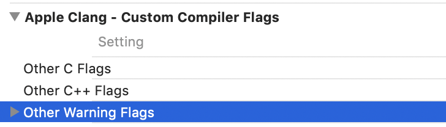

# 工程中代码警告的处理

[⬅️ Back](./)

- [工程中代码警告的处理](#工程中代码警告的处理)
    - [常见警告](#常见警告)
    - [警告的处理](#警告的处理)
        - [代码忽略](#代码忽略)
        - [文件忽略](#文件忽略)
        - [工程忽略](#工程忽略)
            - [普通工程](#普通工程)
            - [Pod 工程](#pod-工程)

<!-- /TOC -->

## 常见警告

| 名称                          | 含义           |
| ----------------------------- | -------------- |
| `-Wunused-variable`           | 声明变量未使用 |
| `-Wincomplete-implementation` | 方法定义未实现 |
| `-Wundeclared-selector`       | 未声明的选择器 |
| `-Wformat`                    | 参数格式不匹配 |
| `-Wdeprecated-declarations`   | 废弃的方法     |
| `-Wunreachable-code`          | 不会执行的代码 |

**NOTE：**忽略某类警告时在警告名称间加 `no-` 即可，形如：`-Wno-unused-variable` 。

> 如何获得要忽略的警告类型？
>
> 在 Xcode Issue navigator 栏可以选中某个警告，右键选中”Reveal in Log“后即可查看警告所属类型。

常见的警告添加方法：

```objc
#warning This is a warning info

- (void)addTapAction:(SEL)tapAction target:(id)target NS_DEPRECATED_IOS(2_0, 4_0);

/**
*	__deprecated
*	__deprecated_msg(_msg)
*/
- (void)addTapAction:(SEL)tapAction target:(id)target __deprecated_msg("接口废弃");

// 方法不可用
+ (instancetype)new NS_UNAVAILABLE;
- (instancetype)init NS_UNAVAILABLE;
```

## 警告的处理

按照忽略层级可以分为三大类：代码忽略、文件忽略、工程忽略。

### 代码忽略

通过特定的宏包裹代码，告诉编译器某部分代码需要忽略警告。

```objc
// 对当前编译环境进行压栈
#pragma clang diagnostic push
// 忽略"对应预编译指令"警告,编译代码
#pragma clang diagnostic ignored "WarningType"
// 对编译环境进行出栈
#pragma clang diagnostic pop
```

### 文件忽略

在 XCode Building Phases 中的 Compile Source 选项中找到需要忽略警告的文件，然后在 Compiler Flags 一栏

中添加忽略类型。

### 工程忽略

#### 普通工程

手动修改 XCode Building Setting 配置文件：



#### Pod 工程

在 PodFile 中消除警告：

```ruby
# 忽略所有第三库的警告
inhibit_all_warnings!

# 忽略某个库的警告
pod 'SDWebImage', '~> 4.3.2', :inhibit_warnings => true
```

在 PodSpec 文件中修改工程配置：

```ruby
s.pod_target_xcconfig = { 'WARNING_CFLAGS' => '-Wno-strict-prototypes' }
```

> 可以使用编辑器打开 xcodeproj 查找对应选项的 Key。

Refs：

- [iOS消除对应的警告！ - 简书](https:www.jianshu.com/p/eb03e20f7b1c)
- [Xcode 常用编译选项设置 - Bannings的专栏 - CSDN博客](https:blog.csdn.net/zhangao0086/article/details/6783074)

---
[⬅️ Back](./)

[⬆️ 回到顶部 ⬆️](#工程中代码警告的处理)